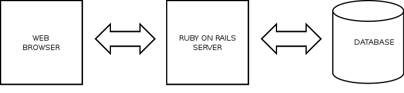
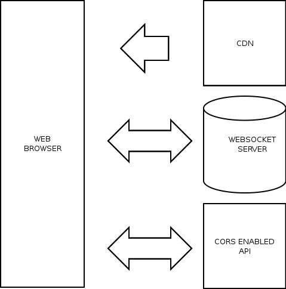

class: center, middle

# YANB Architecture
## aka: you ain't need no backend
## Kuba Kuźma

Silesian Ruby Users Group

Tuesday, January 26, 2016

---

class: center, middle

# ¿Qué?

---

class: center, middle

# Traditional Web Application

---

# Backend Hosting

* Shared Hosting (i.e. rootnode)
* Dedicated Hosting (i.e. OVH)
* Virtual Private Servers (i.e. Digital Ocean)
* Virtual Private Clouds (i.e. EC2)

There's one thing in common: **administration**.

---

# (\w+) as a Service

* Infrastracture as a Service (EC2)
* DevOps as a Service (i.e. Cloud66)
* Platform as a Service (i.e. Heroku)

How do you scale?

---

class: center, middle

# "Backendless" Application

---

# "Backendless" Benefits

* easy, super fast hosting - CDN (i.e. Cloudflare)
* high availability
* DDoS protection
* SSL
* **…und kein DevOps!**

---

# Data Persistence

* Locally
 * Local Storage
 * IndexedDB
* Remotely
 * Google Drive/Spreadsheets
 * Firebase
 * AWS API Gateway
 * Parse
 * Backendless
 * Kinvey
 * Syncano
 * …and many, many more

Worth to mention: authentication, authorization.

---

# Reading Public Data

* CORS Proxies
* YQL
* <s>Yahoo! Pipes</s>
* Google Spreadsheets
* AWS API Gateway

---

# Third Party Integrations

Specificaly: sending emails, text messages, push notifications,
accessing services with private API keys.

* AWS API Gateway with AWS Lambda

---

# Bugtracking

* Airbrake
* BugSense
* Track:js
* errorception

---

# Heavy Processing

* Web Workers (locally)
* AWS API Gateway with AWS Lambda (remotely)

---

# "Backendless" Drawbacks

* not for everyone
* hard to replace dependencies
* testing is tough
* application is susceptible to API changes
* might also be expensive - especially AWS

---

class: center, middle

# Questions?
